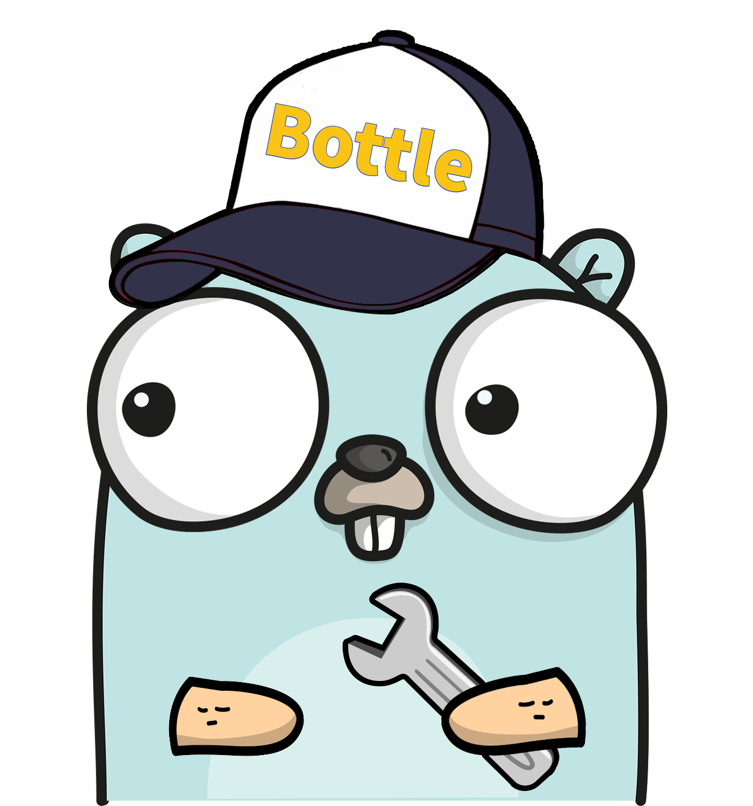

# Bottle

Bottle is a lightweight kv storage engine based on a log structured Hash Table.

[](https://goreportcard.com/report/github.com/auula/bottle)
[](https://github.com/auula/bottle)
[](https://github.com/auula/bottle/blob/master/LICENSE)
[](https://pkg.go.dev/github.com/auula/bottle)
[](https://codecov.io/gh/auula/bottle)
[](https://deepsource.io/gh/auula/bottle/?ref=repository-badge)

---

[简体中文](./README.md) | [English](https://bottle.ibyte.me/docs)

---

### 特 性

- 嵌入的存储引擎
- 数据可以加密存储
- 可以自定义实现存储加密器
- 即使数据文件被拷贝，也保证存储数据的安全
- 未来索引数据结构也可以支持自定义实现

---

### 快速开始

[1. 项目介绍](#简-介)

[2. 基本操作](#基本API)

[3. 数据加密](#加密器)

[4. 散列函数](#散列函数)

[5. 索引大小](#索引大小)

[6. 配置信息](#配置信息)

[7. 数据目录](#数据目录)

[8. 后续计划](#后续维护)

[9. 贡献指南](#其他信息)

---

### 简 介

首先要说明的是`Bottle`是一款`KV`嵌入式存储引擎，并非是一款`KV`数据库，我知道很多人看到了`KV`认为是数据库，当然不是了，很多人会把这些搞混淆掉，`KV`
存储可以用来存储很多东西，而并非是数据库这一领域。可以这么理解数据库是一台汽车，那么`Bottle`是一台车的发动机。可以简单理解`Bottle`是一个对操作系统文件系统的`KV`抽象化封装，可以基于`Bottle`
做为存储层，在`Bottle`层之上封装一些数据结构和对外服务的协议就可以实现一个数据库。


本项目功能实现完全基于 [`bitcask`](https://blog.ibyte.me/post/bitcask-kvbase/) 论文所实现，另外本项目所用到一些知识和`卡内基梅隆大学`
的`CMU 15-445: Database Systems
`课程内容很接近，这门课由数据库领域的大牛`Andy Pavlo`讲授，有感兴趣的朋友可以去看看这套课，如果觉得不错你可以给我按一颗小星`⭐`谢谢。


### 查看资料

- [设计稿](https://blog.ibyte.me/post/bottle-storage-engine-design/)
- [理论稿](https://blog.ibyte.me/post/bitcask-kvbase/)

---

### 安装Bottle

你只需要在你的项目中安装`Bottle`模块即可使用：

```shell
go get -u github.com/auula/bottle
```

### 基本API

如何操作一个`Bottle`实例代码:

```go
package main

import (
	"fmt"
	"github.com/auula/bottle"
)

func init() {
	// 通过默认配置打开一个存储实例
	err := bottle.Open(bottle.DefaultOption)
	// 并且处理一下可能发生的错误
	if err != nil {
		panic(err)
	}
}

// Userinfo 测试数据结构
type Userinfo struct {
	Name  string
	Age   uint8
	Skill []string
}

func main() {

	// PUT Data
	bottle.Put([]byte("foo"), []byte("66.6"))

	// 如果转成string那么就是字符串
	fmt.Println(bottle.Get([]byte("foo")).String())

	// 如果不存在默认值就是0
	fmt.Println(bottle.Get([]byte("foo")).Int())

	// 如果不成功就是false
	fmt.Println(bottle.Get([]byte("foo")).Bool())

	// 如果不成功就是0.0
	fmt.Println(bottle.Get([]byte("foo")).Float())

	user := Userinfo{
		Name:  "Leon Ding",
		Age:   22,
		Skill: []string{"Java", "Go", "Rust"},
	}

	var u Userinfo

	// 通过Bson保存数据对象，并且设置超时时间为5秒，TTL超时可以不设置看需求
	bottle.Put([]byte("user"), bottle.Bson(&user), bottle.TTL(5))

	// 通过Unwrap解析出结构体
	bottle.Get([]byte("user")).Unwrap(&u)

	// 打印取值
	fmt.Println(u)

	// 删除一个key
	bottle.Remove([]byte("foo"))

	// 关闭处理一下可能发生的错误
	if err := bottle.Close(); err != nil {
		fmt.Println(err)
	}
}
```

### 加密器

数据加密器是针对数据的`value`记录的，也就是针对字段级别的区块加密，并非是把整个文件加密一遍，那样设计会带来性能消耗，所以采用区块数据段方式加密的方式。

下面例子是通过[`bottle.SetEncryptor(Encryptor,[]byte)`](https://github.com/auula/bottle/blob/main/option.go#L66)
函数去设置数据加密器并且配置`16`位的数据加密秘钥。

```go
func init() {
    bottle.SetEncryptor(bottle.AES(), []byte("1234567890123456"))
}
```

你也可以自定义去实现数据加密器的接口：

```go
// SourceData for encryption and decryption
type SourceData struct {
    Data   []byte
    Secret []byte
}

// Encryptor used for data encryption and decryption operation
type Encryptor interface {
    Encode(sd *SourceData) error
    Decode(sd *SourceData) error
}
```

下面代码就是内置`AES`加密器的实现代码，实现[`bottle.Encryptor`](https://github.com/auula/bottle/blob/main/encrypted.go#21)
接口即可，数据源为[`bottle.SourceData`](https://github.com/auula/bottle/blob/main/encrypted.go#15) 结构体字段：

```go
// AESEncryptor Implement the Encryptor interface
type AESEncryptor struct{}

// Encode source data encode
func (AESEncryptor) Encode(sd *SourceData) error {
    sd.Data = aesEncrypt(sd.Data, sd.Secret)
    return nil
}

// Decode source data decode
func (AESEncryptor) Decode(sd *SourceData) error {
    sd.Data = aesDecrypt(sd.Data, sd.Secret)
    return nil
}
```

具体的加密器实现代码可以查看[`encrypted.go`](./encrypted.go)

### 散列函数

如果你需要自定义实现散列函数，实现[`bottle.Hashed`](https://github.com/auula/bottle/blob/main/hashed.go#10) 接口即可：

```go
type Hashed interface {
    Sum64([]byte) uint64
}
```

然后通过内置的[`bottle.SetHashFunc(hash Hashed)`](https://github.com/auula/bottle/blob/main/option.go#85) 设置即可完成你的散列函数配置。

### 索引大小

索引预设置的大小很大程度上会影响你的程序存取和读取数据的速度，如果在初始化的时候能够预计出程序运行时需要的索引大小，并且在初始化的时候配置好，可以减小程序在运行过程中带来的运行数据迁移和扩容带来的性能问题。

```go
func init() {
    // 设置索引大小 
    bottle.SetIndexSize(1000)
}
```

### 配置信息

你也可以不使用默认配置，你可以使用内置的[`bottle.Option`](https://github.com/auula/bottle/blob/main/option.go#14) 的结构体初始化你存储引擎，配置实例如下：

```go
func init() {
        // 自定义配置信息
        option := bottle.Option{
        // 工作目录
        Directory:       "./data",
        // 算法开启加密
        Enable:          true,
        // 自定义秘钥，可以使用内置的秘钥
        Secret:          bottle.Secret,
        // 自定义数据大小，存储单位是kb
        DataFileMaxSize: 1048576,
    }
    // 通过自定义配置信息
    bottle.Open(option)
}
```

当然也可以使用内置的[`bottle.Load(path string)`](https://github.com/auula/bottle/blob/main/bottle.go#157) 函数加载配置文件启动`Bottle`
，配置文件格式为`yaml`，可配置项如下：

```yaml
# Bottle config options
Enable: TRUE
Secret: "1234567890123456"
Directory: "./testdata"
DataFileMaxSize: 536870912
```

需要注意的是内置的加密器实现的秘钥必须是`16`
位，如果你是自定义实现的加密器可通过[`bottle.SetEncryptor(Encryptor,[]byte)`](https://github.com/auula/bottle/blob/main/option.go#L66)
设置你自定义的加密器，那这个秘钥位数将不受限制。

### 数据目录

由于`bottle`设计就是基于但进程的程序，所以每个存储实例对应是一个数据目录，`data`为日志合并结构数据目录，`index`为索引数据版本。

日志合并结构数据目前版本是每次数据启动时候进行合并，默认是`data`数据文件夹下的所有数据文件占用总和超过`1GB`就会触发一次合并，合并之后没有用的数据被丢弃。

当然如果未达到脏数据合并要求，数据文件会以启动时候配置的大小进行归档，每个数据有版本号，并且被设置为只读挂载，进程工作目录结构如下：

```shell
./testdata
├── data
│   └── 1.data
└── index
    ├── 1646378326.index
    └── 1646378328.index

2 directories, 3 files
```

当存储引擎开始工作的时候，这个目录下的所以文件夹和文件只能被这个进程操作，保证数据安全。

### 后续维护

- `Bottle`目前不支持多数据存储分区，后续版本会引入一个`Bucket`概念，未来可以把指定的数据存储到指定的分区中，来降低并发的时候索引锁的颗粒度。
- 后续将引入`零拷贝技术`，当前文件操作很大程度上依赖于操作系统，当前文件必须`sync`才能保证数据一致性。
- 脏数据合并可以在运行中进行合并整理，基于`信号量`的方式通知垃圾回收工作线程。

### 其他信息

如果你发现了`bug`欢迎提`issue`或者发起`pull request`，我收到了消息会尽快回复你，另外欢迎各位`Gopher`提出自己意见，或者贡献做自己的代码也是可以的，另外我们也非常大家进入群进行存储相关技术交流。


### 鸣谢Contributions


